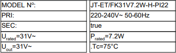
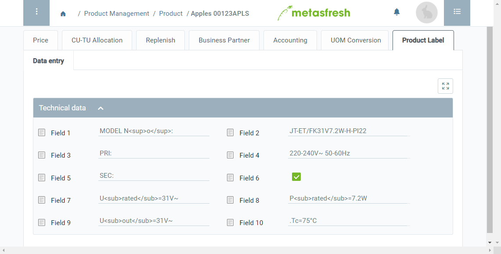

## Overview
In metasfresh, you can create custom record tabs in several input windows where you can enter your own specific data. These data can be organized by subtabs, sections, lines and input fields and can also be printed in the form of product labels or nameplates.

## Requirements
- [Create a custom record tab in the window "Product" including subtabs](Add_custom_record_tab), [sections, lines](Add_section_to_sub_tab) and [fields](Add_fields_to_section_lines) according to your requirements.

## Steps

### Enter product label data
1. Open the entry of an existing [product](Menu) or [add a new one](NewProduct).
1. Go to the custom record tab at the bottom of the page and enter the label data here.

| **Note:** |
| :--- |
| You can use HTML tags to format characters and words as subscript and as superscript: |
| •&nbsp;**Superscript:** min``-1`` &rarr; min-1   •&nbsp;**Subscript:** H``2``O &rarr; H2O |

### Print product label
1. [Start the action](StartAction) "Products Data Entry (Jasper)".
1. The PDF print preview of the product label opens up in a new browser tab.

## Example

### Product label

### Input window

