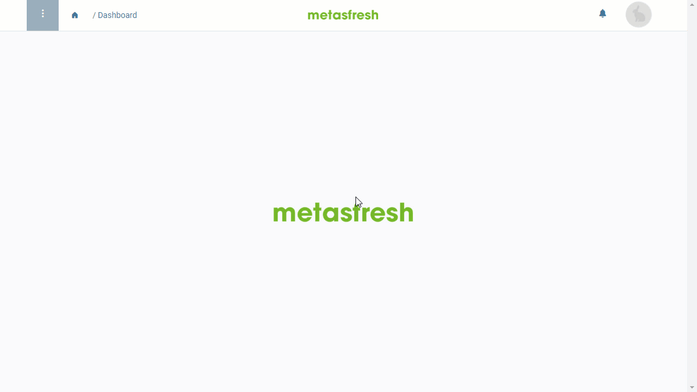

## Overview
In metasfresh, multiple users can be combined into a group to make it possible to collectively assign certain properties to them as needed, e.g., [access permissions for individual data entries](Manage_user_permission).

## Steps
1. Open "User Group" from the [menu](Menu).
1. [Create a new user group](New_Record_Window).
1. Give the user group a **Name**.
1. Go to the record tab "Users Group User Assignment" at the bottom of the page and click . An overlay window opens up.
1. In the field **Contact**, enter a part of the name of the user you want to add to the group and click on the matching result in the <a href="Keyboard_shortcuts_reference#dropdown" title="Dynamic Search Box (Autocompletion)">drop-down list</a>.
1. Set a **Valid from** date.
 >**Note:** If this date lies in the *past*, the entry will be effective *immediately*. If it lies in the *future*, it will only apply *from that date*.

1. Set a **Valid through** date.
1. Click "Done" to close the overlay window and add the user to the list.
 >**Note:** Repeat steps 4 to 8 to add further users.

1. [metasfresh saves the progress automatically](Saveindicator).

## Example
<kbd></kbd>
