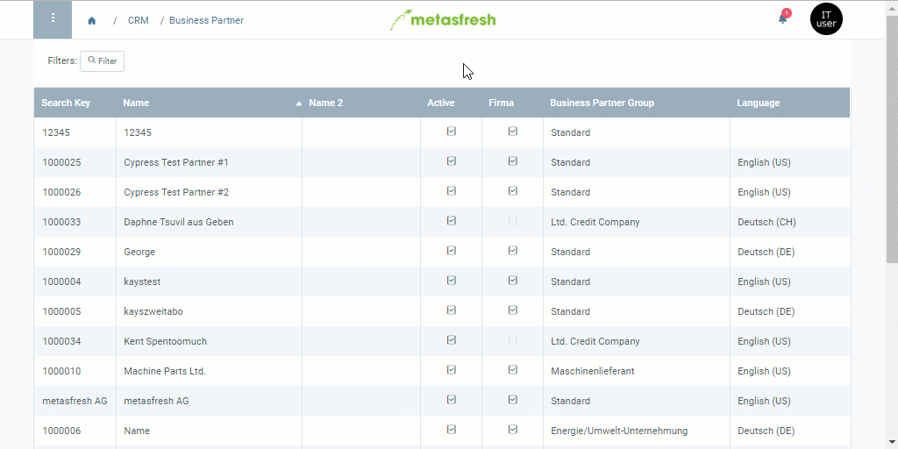

## Overview
Only authorized users can confirm requests for approval of credit limits. They receive a notification once an approval is requested.

## Requirements
- [Approval for a credit limit must be requested](Credit_limit_request_approval).

## Steps
1. Open the entry of the [business partner](Menu) for whom you have received a request for approval, or click on the [notification](Notification_types)  to open the entry.
1. Go to the record tab "Credit Limit" at the bottom of the page and [select the line of the credit limit](RecordSelection) you want to approve.
 >**Note:** The box in the column **Approved** of this line is unchecked.

1. [Start the action](StartAction) "Credit Limit Approve".
1. [metasfresh saves the progress automatically](Saveindicator).
 >**Note:** The message "Process completed successfully" is displayed in the upper right corner of the window, the box in the column **Approved** is checked and the field **Approved by** is filled in with the name of the authorized user.

 

| **General Note:** |
| :--- |
| You can also [add credit limit types](Add_credit_limit_type) where the credit limit is approved automatically, i.e. no authorized user's approval is required. In this case, the field **Approved by** of the credit limit line remains empty. |

## Example

