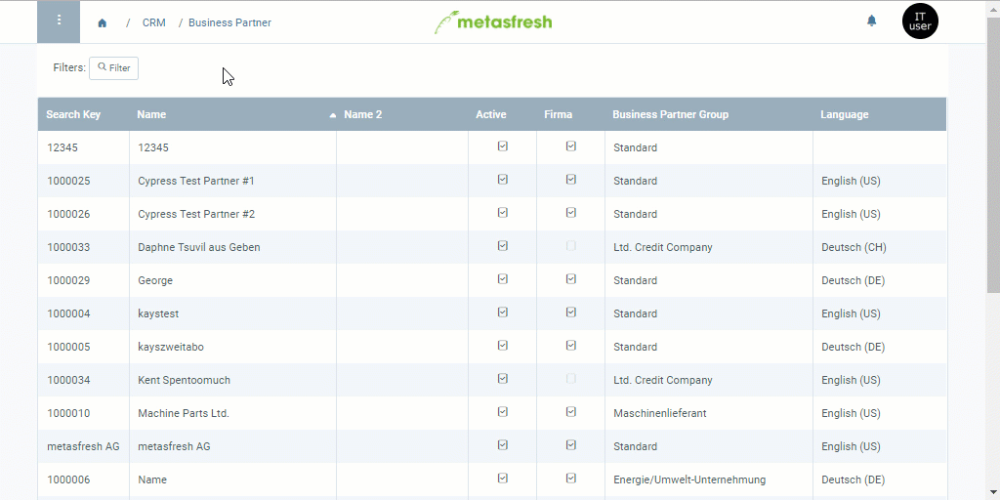

## Overview
Before a credit limit can take effect, it first has to be approved by an authorized user.

## Steps
1. [Set a credit limit for a business partner](Set_credit_limit).
1. Go to the record tab "Credit Limit" at the bottom of the page and [select the line of the credit limit](RecordSelection) for which you want to request approval.
1. [Start the action](StartAction) "Credit Limit Request Approval". An overlay window opens up.
1. In the field **Approved by**, select the authorized user who shall approve your request.
1. Click "Start" to request the approval and close the overlay window.
 >**Note:** The authorized user will now receive a notification  in the upper right corner with the request to approve the credit limit.

## Next Steps
- [Approve credit limit (only authorized users)](Credit_limit_approval).

## Example

