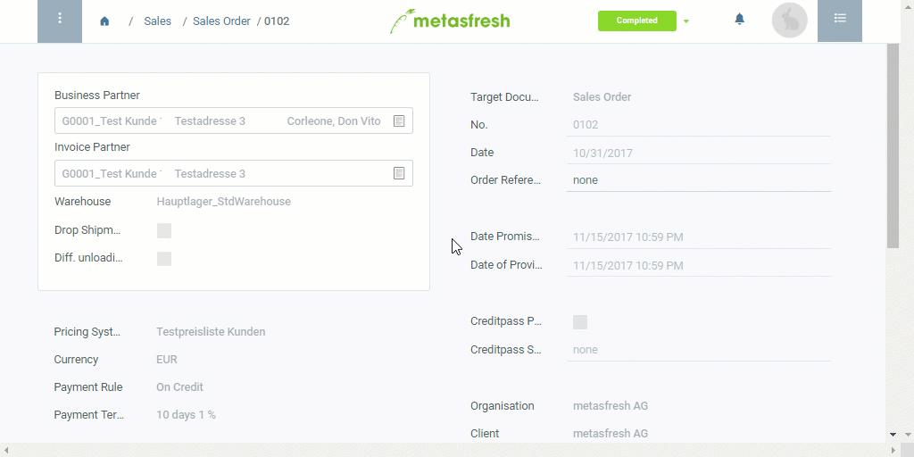

## Overview
In metasfresh, you can create credit notes (or memos) if, after invoicing, a credit balance results in favor of the customer, e.g., due to quantity differences after a delivery. The credit notes are directly linked to the corresponding invoices, which makes the changes seamlessly traceable for the accounting department.

## Steps

### Create a credit note
1. Open "Sales Invoice" from the [menu](Menu).
1. [Use the filter](Filtering_function) to find the entry of the completed invoice for which you want to create a credit note and open it.
 >**Note:** Alternatively, use a [sales order](SalesOrder_recording)'s [related documents to jump](JumptoviaSidebar) to the corresponding [invoice](Invoice_SalesOrder).

1. [Start the action](StartAction) "Gutschrift erstellen" (*Create credit note*). An overlay window opens up.
1. Pick the **Document Type** *Credit Memo - Deliver Diff*.
1. Click "Start" to create an invoice document for the credit note and close the overlay window.

### Record the quantity difference
1. Use the completed invoice's [related documents to jump](JumptoviaSidebar) into the window "Sales Invoice" again (under BILLING and then "Invoice (Customer)" in the sidebar) and then open the associated invoice entry with the **Target Document Type** *Credit Memo - Deliver Diff* which has already been [found by the filter](Filtering_function).
1. Go to the record tab "Invoice Line" at the bottom of the page and enter the amount of the quantity difference into the field in the column **Quantity TU** and/or **Quantity** of the relevant line.
1. [Select](RecordSelection) and delete all lines irrelevant for the credit note.
1. ***Optional:*** Click  to add lines.
 >**Note:** Use shortcut `Alt` + `Q` / `⌥ alt` + `Q`.

### Complete the credit note
1. [Complete the document](DocumentProcessingComplete).
1. [Open the PDF preview](PrintPreview).

## Example

