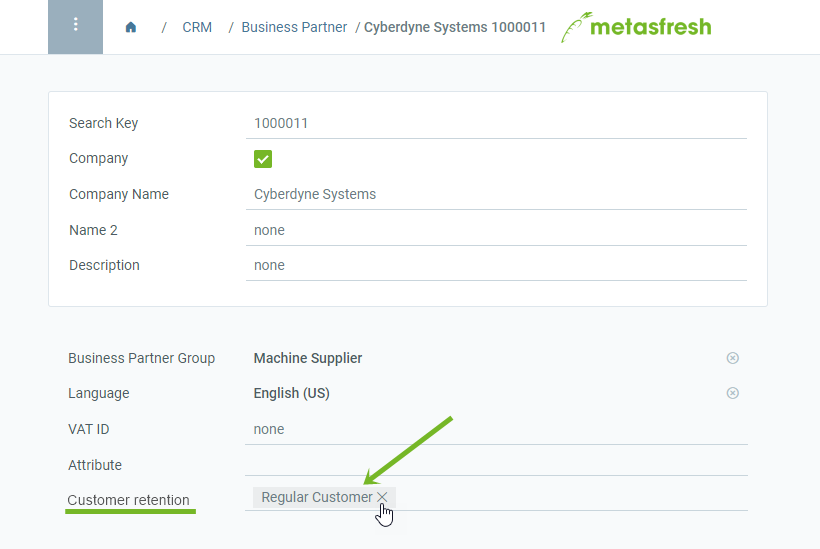

## Overview
When you add a new customer in metasfresh, they will not have any particular customer status at first. As soon as you create a contract for this customer, however, they will become a *New Customer*. From the moment of the second invoice, the status will change to *Regular Customer* and remain up to 12 months after the end of the contract. Unless a new contract is created for this customer within this period or the old one is extended, the customer status will fall back to no status.

Customer statuses are updated automatically per day. Manual updating can be done via "[Create Missing Customer Retention](Menu)" in the menu.

## Steps

### Create a contract and invoice it
1. [Add a new customer](New_business_partner_customer), if you have not yet done so.
1. [Create a contract for this customer](Create_subscription_contract). The customer will now receive the status "New Customer".
1. [Create an invoice](Invoice_SalesOrder) for this contract (1st invoice).
1. [Extend the contract](Extend_contract).
1. [Create an invoice](Invoice_SalesOrder) for the extended contract (2nd invoice). The customer will now receive the status "Regular Customer".

### View customer retention status
1. Open the entry of a customer in the [detailed view](ViewModes) under "[Business Partner](New_Business_Partner)" in the menu.
1. Look for the field **Customer retention**.

