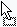
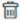
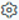
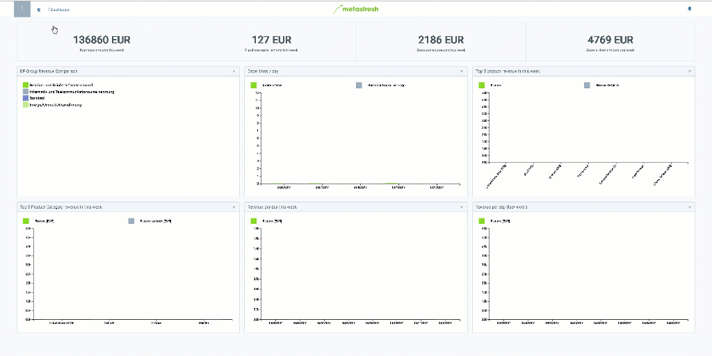

## Overview
The metasfresh dashboard loads automatically right after login and shows real-time dynamic data through various widgets.

You may also customize the dashboard according to your own requirements by adding, removing, repositioning and editing widgets. To do so, please proceed as follows:

## Customize the Dashboard
1. [Log in to metasfresh](Login) or open "DASHBOARD" from the [menu](Menu).
1. Open the [actions menu](StartAction#actions-menu)  and click "Open edit mode". A small selection pane opens up on the right-hand side of the page showing the available widgets.
 >**Note:** Use shortcut `Alt` + `O` / `⌥ alt` + `O`.

1. In order to close the selection pane and exit the edit mode, return to the [actions menu](StartAction#actions-menu) and click "Close edit mode".

### Add Widgets
- Click on a widget in the selection pane and drag and drop it  in the desired place on the dashboard.
 >**Note:** If a widget cannot be dropped in a specific place, the mouse cursor will transform into this symbol .

### Remove Widgets
- Simply click on the small delete icon  in the top right-hand corner of the widget you want to remove from the dashboard.

### Reposition Widgets
- Click on a widget on the dashboard and drag and drop it in a different place on the dashboard.

### Edit Widgets
1. Click on the small cogwheel   in the top right-hand corner of the widget you want to edit. An overlay window opens up.
1. In the field **Caption**, you may change the widget's caption.
1. Click "Save" to apply the changes and close the overlay window.

## Example

