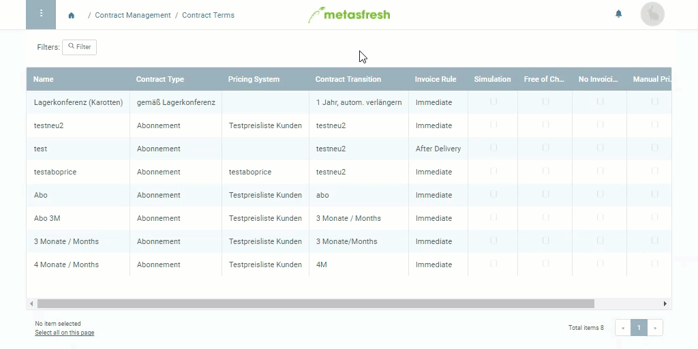

## Steps
1. Open "Contract Terms" from the [menu](Menu).
1. [Create a new entry](New_Record_Window).
1. Give the contractual terms a **Name**.
1. Pick a **Contract Type**, e.g., *Subscription*, *Commission* or *Procurement contract*.
1. If available, in the field **Pricing System**, enter a part of the desired [pricing system](Add_price-system) and click on the matching result in the <a href="Keyboard_shortcuts_reference#dropdown" title="Dynamic Search Box (Autocompletion)">drop-down list</a>.
1. In the field **Contract Transition**, set a [contract period](Define_contract_period).
1. In the field **Invoice Rule**, pick a time for invoicing, e.g., *Immediate* or *After Delivery*.
1. In the field **When extending contract**, pick a method to determine the prices for subsequent contracts, e.g., *Calculate prices from master data* or *Copy prices from predecessor*.
1. [Complete the document](DocumentProcessingComplete).

## Example
<kbd></kbd>
