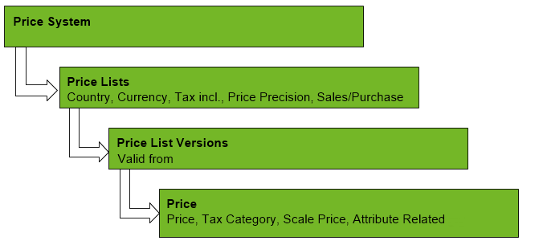

## Overview

## Steps
1. [Add a pricing system](Add_price-system).
1. [Add a price list](Add_price-list).
1. [Add a price list version](Add_price-list-version).
1. [Add a price](Add_price).
1. [Assign the prices to a partner](Assign_prices_to_partner).
