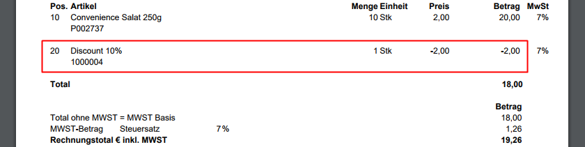

## Overview
The discount schemas in metasfresh are very adjustable and highly versatile. You can apply them to individual products or entire product categories, configure them as tiered discounts and group discounts, and assign them individually to business partners.

Furthermore, you can cleverly combine the different discount types with each other, as well as apply them manually or even set up automatic discount schemas.

You can use discounts at the point of the order line input of a [sales order](SalesOrder_recording) or a [purchase order](CreatePurchaseOrder). 
The following discount types are available:

## Order Line Discounts
The [order line discount](Order_line_discount) is assigned to each order line individually and does not appear as a separate discount line. It merely reduces the product price and can therefore only be identified in the reduced total on the invoice.

### Example

---

## Order Line Group Discounts (Compensation Groups)
With the [order line group discount](Order_line_group_discount) you can combine any number of order lines into a *compensation group* designated for the discount. This group discount will then be displayed as a separate discount line and will also appear as such on the invoice. You can create any number of compensation groups in one order. However, each discount line can only be associated with one single compensation group.

### Example

---

## Automatic Volume Discount Schema (Tiered Discount)
By means of the [automatic volume discount schema](Automatic_volume_discount) you can preset specific discount conditions, such as **Tiered Discounts (Volume Discounts)** for individual products or entire product categories, and assign them to a business partner or group.

Upon fulfillment of these conditions in an order request by this business partner, the discounts will be applied automatically.
