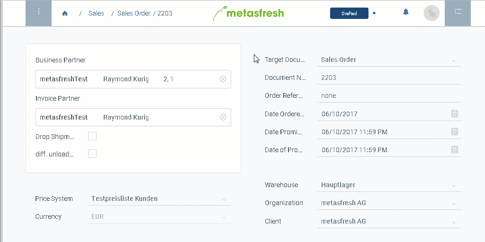

## Overview
Documents are saved automatically by metasfresh. However, they will not be processed unless their status is set to "complete".

### Keyboard shortcut
Press `Ctrl + U` to set the status to "complete".

### With the mouse

Click on the button for the document processing actions (`Ctrl + I`) in the upper right corner of the window and select "Complete". 

## Example

