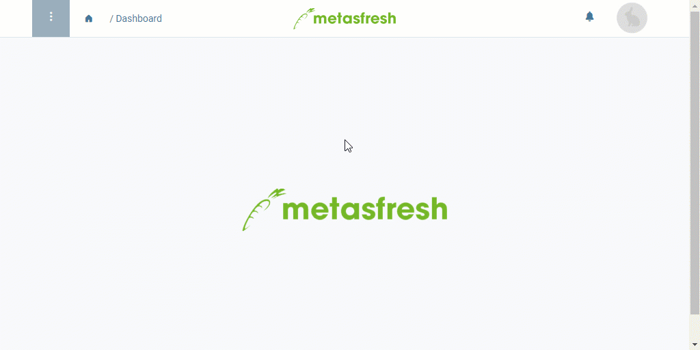

## Overview
In metasfresh, you can quickly and easily combine dunning letters with their associated invoice documents in a PDF file. This way, you can print the documents all at once or forward them all together to the respective dunning candidate.

## Requirements
- [Create the dunning documents for a dunning candidate](Dunning_Run).

## Steps
1. Open "Dunning" from the [menu](Menu).
1. [Use the filter](Filtering_function) to find the dunning letter where you want to attach the associated invoice documents.
1. From the [list view](ViewModes), [select](RecordSelection) the respective entry.
1. [Start the quick action](StartAction) "Dunning document with attached invoice PDFs".
 >**Note:** You will also find this action in the actions menu in both the list view and the detailed view of an entry.

1. The PDF print preview of the dunning letter with the attached invoice PDFs opens up in a new browser tab.

## Example

