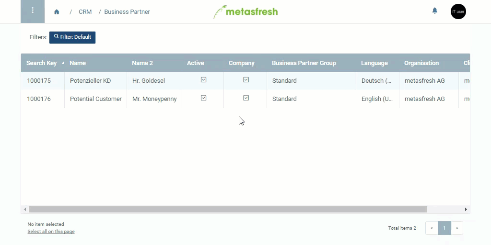

## Steps
1. Open "Business Partner" from the [menu](Menu).
1. Select the Business Partner from the [list view](ViewModes).
1. Go to the tab "Customer" at the bottom of the page.
1. Open the [Advanced Edit Menu](Open_AdvancedEditTab).
1. Set the field **Aggregationrule Customer Invoices** to the desired aggregation rule.
 >**Note:** For the standard case select "invoicing-agg-std".

1. Click "Done" to close the window.

## Explication of the Rules

| Rule | Description | Explanation |
|---|---|---|
| invoicing-agg-std | Standard Rule | Aggregation is done without restrictions
| none | | An invoice is always created for each order

## Example

