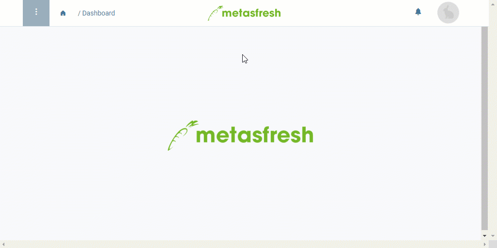

## Overview
In metasfresh, you can easily export all product specifications in one go.

For more information on how to export selected data entries, please see [here](Data_export_metasfresh).

## Steps
1. Open "Product" from the [menu](Menu) in the [list view](ViewModes#list-view).
1. [Start the action](StartAction#actions-menu) "Export Product Specifications". The "Save As" dialog box opens up.
1. Use the suggested file name or change it ad lib and save the file in a directory of your choice.
1. Browse to this directory and open the file in a spreadsheet software, e.g., *Microsoft Excel*.

## Example
<kbd></kbd>
