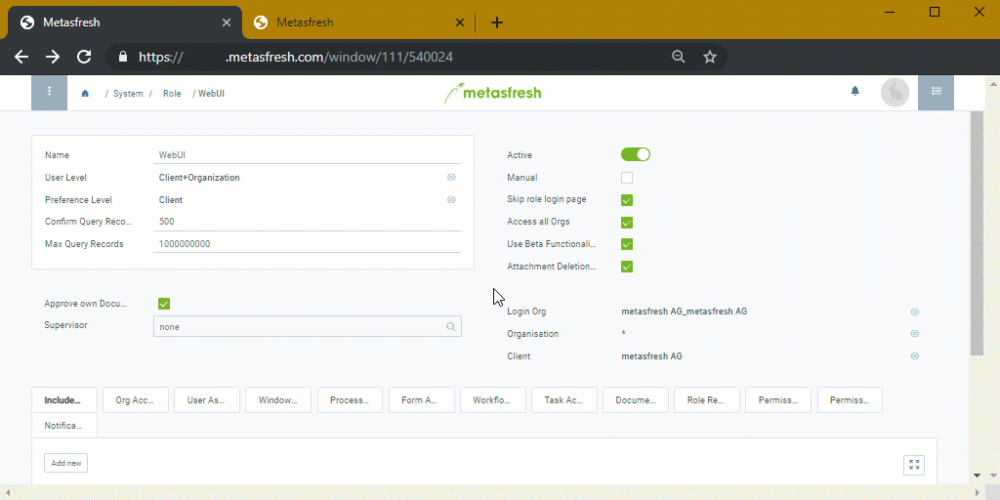

## Overview
In metasfresh, you can set that only certain users have permission to [delete file attachments](File_handling). For all others, the delete function remains hidden and they can only open and download the files. This prevents files from being (accidentally) deleted by unauthorized users.

When an attachment is deleted by an authorized user, an entry is created in the attachment's change log, including the file name and the name of the user who deleted the attachment. This ensures that it is always possible to determine who deleted a file attachment and at what time.

## Steps

### Set delete permission
1. Open "Role" from the [menu](Menu).
1. Open the entry of the [user role](NewUserRole) for which you want to set the delete permissions.
1. Tick the checkbox **Attachment Deletion Allowed** to allow a user role to delete attachments, or uncheck it to withdraw deletion rights.
1. [metasfresh saves the progress automatically](Saveindicator).

### View change log
1. Use the [related documents of the data entry](JumptoviaSidebar) where you deleted a file attachment to jump into the window "Attachment change log" (under SYSTEM in the sidebar).
1. Here you can find a log entry for each deletion.

## Example

