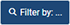
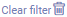

## Overview
If you are searching for specific entries in a window (such as [business partners](New_Business_Partner), [sales orders](SalesOrder_recording), [products](NewProduct), etc.) you can display them separately by using the filtering function.

## Steps
1. [Open a window](Menu) of your choice in [list view](ViewModes#list-view), e.g., "[Sales Order](Menu)".
1. Click  at the top left of the window to open the filter mask and then click .
1. Enter the keywords of your choice into the search fields and/or pick the desired [attributes](Add_attributes_to_BP) by which you want to filter the table and click .
 >**Note:** Press `Alt` + `↵ Enter` / `⌥ alt` + `↵ Enter` to apply the filter criteria.

1. To empty the search fields, click  and then click  in the top right-hand corner of the filter mask.

### Filter by "Active" status
Some entries can also be filtered by "Active" status, i.e. whether a property is active or inactive. For example, in the "[Phone Call Schedule](Phone_call_scheduling_filtering)" window, you can filter by entries with and ***without*** sales orders, as well as by entries with called contacts and ***calls yet to be made***.

| Option | Checkbox |
| :--- | :---: |
| Click once on the checkbox to activate it and search for entries where this property is activated. |  |
| Click on it a second time to search for entries where this property is ***not*** activated. |  |
| Click on `(clear)` on the right-hand side of the activated checkbox to deactivate it. |     |

## Next Steps (optional)
- [Use the area search to limit the results when filtering entries to a specific geographical area](Area_search_geocoding).
- [Create custom filters](Create_custom_filters).

## Example
<kbd></kbd>
