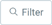
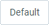

## Overview
If you are searching for specific entries in a window (such as [business partners](New_Business_Partner), [sales orders](SalesOrder_recording), [products](NewProduct), etc.) you can display them separately by using the filtering function.

## Steps
1. Open the window of your choice in [list view](ViewModes), e.g., "[Sales Order](Menu)".
1. Click  at the top left of the window and then click .
1. Enter the desired keywords and/or select the desired [attributes](Add_attributes_to_BP) by which you want to filter the table and click .
 >**Note:** Press `Alt` + `↵ Enter` / `⌥ alt` + `↵ Enter` to apply the filter criteria.

## Next Steps (optional)
- [Use the area search to limit the filter results to a specific geografical area](Area_search_geocoding).

## Example

