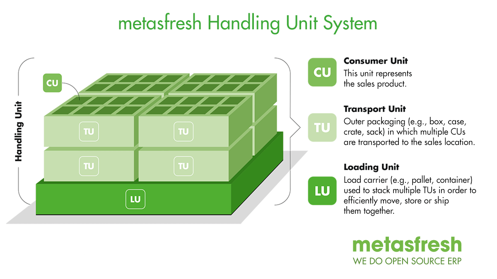

## Overview
metasfresh enables you to not only keep products with their total quantity in stock, but also to manage them according to their individual properties and thus map their exact form in which they are available.

For instance, 10 pieces of ready-made salad in plastic bags can be packed in a crate, of which 20 pieces are stacked on a pallet.

This system of mapping products (so-called *consumer units = CU*) along with their containers or packaging (*transport units = TU*) and their load carriers (*loading units = LU*) is what we refer to as **Handling Unit System**.

Hence, the combination of a CU inside a TU in/on an LU is called a **Handling Unit (HU)**.

<kbd></kbd>

## Examples

| HU component | Type | Example |
| :---: | :---: | :--- |
| CU | Product | Piece goods (e.g., lettuce), dry bulk goods (e.g., sand) or liquid bulk goods (e.g., milk) |
| TU | Packaging | One-way containers, reusable containers (e.g., Euro containers, IFCO trays), stand-up displays, beverage crates, etc. |
| LU | Load carriers | Pallets, containers, PALOXE pallet boxes, etc. |

## Setup

| HU component | Configuration |
| :---: | :--- |
| CU | [How do I allocate a product to a transport unit?](CU-TU_Allocation) |
| TU | [How do I create packing instructions?](Create_packing_instructions) |
| LU | How do I allocate an LU to packing instructions? |

## Clarification of Terms

| Term | Answers this question |
| :--- | :--- |
| CU (Consumer Unit) | What is my [product](NewProduct)? |
| TU (Transport Unit) | What type of packaging is used for my product? |
| LU (Loading Unit) | Which load carrier is used? |
| [Packing instructions](Create_packing_instructions) | Which requirements apply to a packaging? |
| [Packing material](Set_up_packing_material) | What type of packing material is the packaging made of? |
| Packaged good | Am I allowed to put a product into this packaging? |
| VirtualPI | Is the HU a physical packaging or a virtual one? |
| Handling Unit Type | Is it a VirtualPI, TU or LU? |
