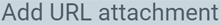

## Steps

### Save URL as attachment
1. [Open](Menu) the document to which you want to attach a URL bookmark, e.g., a "[business partner](New_Business_Partner)".
1. Press `Alt` + `7` / `⌥ alt` + `7` to jump to the list of attachments  in the [sidebar](JumptoviaSidebar) .
1. Click on . A small input overlay window opens up.
1. Copy and paste the desired URL (e.g., http://metasfresh.com/en/) into the field **URL**.
1. In the field **Name**, you can name the URL bookmark, e.g., "metasfresh Homepage". If you do not assign any name, the URL will be taken instead.
1. Click "Create" to add the bookmark to the list of attachments and close the overlay window.
 >**Note:** You can attach as many URLs per document as you require.

### Open URL
[Jump to](JumptoviaSidebar) the list of attachments by pressing `Alt` + `7` / `⌥ alt` + `7` and open the URL simply by clicking its bookmark (see example).

### Delete URL
1. [Jump to](JumptoviaSidebar) the list of attachments by pressing `Alt` + `7` / `⌥ alt` + `7`.
1. Click on the small delete icon  next to the URL bookmark you want to delete (see example).
 >**Note:** If the delete icon does not appear, your user role may not be permitted to delete file attachments. [Follow these instructions](File_handling_delete_permission) to change the delete permissions for user roles.

1. A small dialog box appears asking you, "Are you sure you want to delete the attachment?" – Click "Ok" to confirm.

## Example

