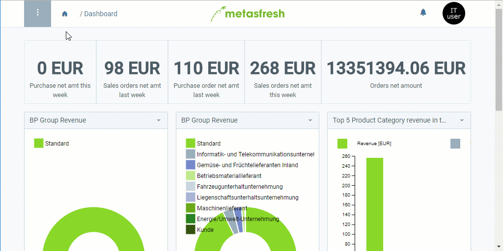

## Requirements
Make sure to comply with all requirements for the [data import in metasfresh](Data_import_metasfresh). [Here you can find a format example for importing business partner data](Import_format_example_bpartner).
 >**Note:** For importing business partner data, you require an import format that is configured with the **database table** *Import Business Partner*.

## Steps
1. Open "Data Import" from the [menu](Menu).
1. Open an appropriate data import entry or [add a new one](add_new_data_import_entry).

### Upload and import the file
1. [Upload your import file containing the business partner data](File_handling).
1. [Start the action](StartAction) "Import attachment". An overlay window opens up.
1. In the field **Attachment**, select the uploaded [import file](Import_file_useful_tips).
1. Click "Start" to import the business partner data and close the overlay window.

### Review Business Partner Data
1. Open "Import Business Partner" from the [menu](Menu). Here you will find all imported business partner entries.
1. Open the entry of the business partner whose data you want to review and correct, if necessary.
 - If all data are transferred properly and without errors, this business partner entry will be read-only and you can find the imported data under "[Business Partner](Menu)" in the menu. All further changes can be made there.
 - Should data be transferred incorrectly or be missing after the import, you can review and edit each business partner entry under "[Import Business Partner](Menu)". After you have rectified all inaccuracies, you can now manually import the business partner data. To do so, please proceed as follows:

#### Manual Business Partner Data Import
1. [Start the action](StartAction) "Import Business Partners". An overlay window opens up.
1. Click "Start" to import the business partner data and close the overlay window.
1. You will find the imported business partner data under "[Business Partner](Menu)" in the menu.

## Example

