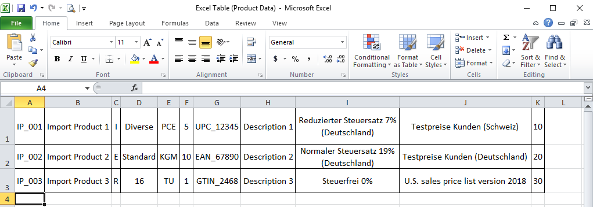
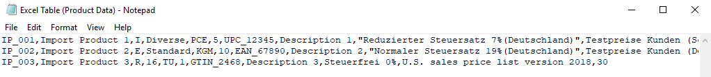
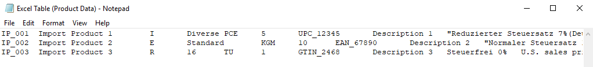

## Overview
In order to import externally stored data into metasfresh, you first have to format the data appropriately, upload them as a CSV or a TXT file and then simply import them via the [actions menu](StartAction).

Here are some format examples for the import of:
- [Business partner data](Import_format_example_bpartner)
- [Discount schema data](Import_format_example_discount_schema)
- [Product data](Import_format_example_product)
- [Replenishment data](Import_replenishment_data)

## Useful Tips
When creating an import file, please keep in mind the following:

- The **separator** in the import file must coincide with the one set in the [import format](Add_import_format) (comma, semicolon, tab, etc.).
- If you want to create a **comma delimited** import file using a spreadsheet software, such as *Microsoft Excel*, simply select the file format `CSV (Comma delimited)(*.csv)` when saving the file.
- If you want to create a **tab delimited** import file using a spreadsheet software, such as *Microsoft Excel*, simply select the file format `Text (Tab delimited)(*.txt)` when saving the file.
- The positions of the columns in the import file must correspond to the values of the format fields' **start numbers** of the import format. 
***Example:*** **Column C** of the Excel spreadsheet is in the third place, ergo the corresponding format field receives the **Start No. 3**.
 >**Note:** metasfresh does ***not expect any column names*** in the import file. Simply the ***position*** of the column must correspond to the start number.

## Next Steps
- [Import business partner data](Import_bpartner_data).
- [Import discount schema data](Import_discount_schema).
- [Import product data](Import_product_data).
- [Import replenishment data](Import_replenishment_data).

## Example: Excel Spreadsheet (Product Data)

## Example: CSV File, Comma delimited (Product Data)

## Example: TXT File, Tab delimited (Product Data)

