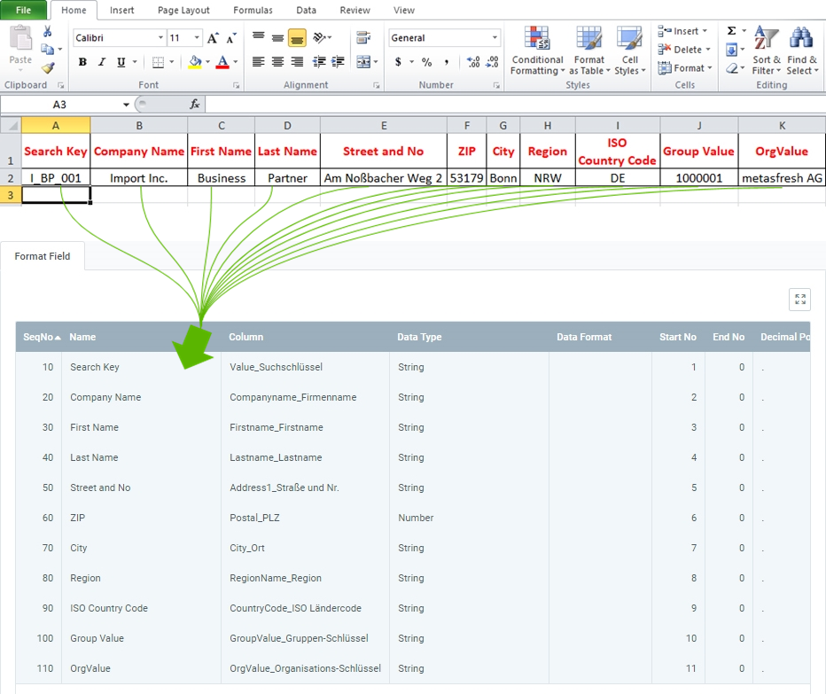

## Overview
For importing business partner data, you require an import format that is configured with the **database table** *Import Business Partner*.

The example below compares the data content of a file from a spreadsheet software (here, e.g., an *Excel* file prior to its [conversion to a CSV or TXT file](Import_file_useful_tips)) with the import format for business partner data:

### Explanatory Notes to the Example
- **Column A** of the Excel spreadsheet (*Search Key*) is in the first place, ergo the corresponding format field is given the **Start No. 1**. Consequently, the format field for **Column B** receives the **Start No. 2** etc.  The order (**SeqNo**) of the format fields is therefore irrelevant.
 >**Note:** metasfresh does ***not expect any column names*** in the import file. Simply the ***position*** of the column must correspond to the start number.

- The **Name** of the format field may be chosen freely and does not have to coincide with the column name in the import file.
- The **Column** of the format field specifies where metasfresh shall transfer the content of the column from the import file.
- The **Data Type** specifies whether the type of the import data is, e.g., a *String* or a *Number*.

### Some useful notes
The mandatory fields are essential for a successful data import!

| Mandatory Field | Field Name | Example | Note |
| :---: | :---: | :--- | :--- |
| X | Search Key | I_BP_001 | Business partner number (unique alphanumeric string) |
| X | Name | • Import Inc.  • Business Partner | **Company name** or **partner name** (for individuals) |
| (X) | Contact Name | John Smith | This information is only required in connection with **contacts** to be imported. |
| (X) | ISO Country Code | DE | DE = Germany (Ger.: _**De**utschland_)  Two-letter country code (in acc. with ISO 3166-1 alpha-2). This information is only required in connection with addresses to be imported.   (*You can look up the ISO country code under "[Country, Region](Menu)" in the menu.*) |
| X | Group Value	| • Standard  • 1000001 | **Search Key** of the business partner group.  ***Attention:*** Not the name!  First add the business partner group and then use the search key here.  (*You can look up the search key in the respective entry under "[Business Partner Group](Menu)" in the menu.*) |
|  | Region | • NRW  • AZ | NRW = **N**orth **R**hine-**W**estphalia  AZ = **A**ri**z**ona  (*You can look up the acronym (**Name**) of a region under the record tab "Region" of the respective country entry under "[Country, Region](Menu)" in the menu.*) |
|  | OrgValue | metasfresh AG | **Search Key** of the organization.  ***Attention:*** Not the name!  (*You can look up the search key under "[Organization](Menu)" in the menu.*) |
|  | Location Data | • Street & House No.  • ZIP  • City  • Region  • ISO Country Code | For [location data](Add_address_tab) to be imported, at least **City** and **ISO Country Code** must be provided.   Location data, such as **Street & House No.**, **ZIP** or **Region**, will not be imported unless both **City** and **ISO Country Code** are provided. |
|  | Global Location Number (GLN) | 1234567890128 | In order to import a **GLN**, both **City** and **ISO Country Code** are required. |
|  | Web address (URL) | [**https://**metasfresh.com/](https://metasfresh.com/en/ "metasfresh Homepage") | For a **URL** to work after import, make sure it begins with the Internet protocol acronym (e.g., `https://`). |

## Next Steps
- [Import business partner data](Import_bpartner_data).
