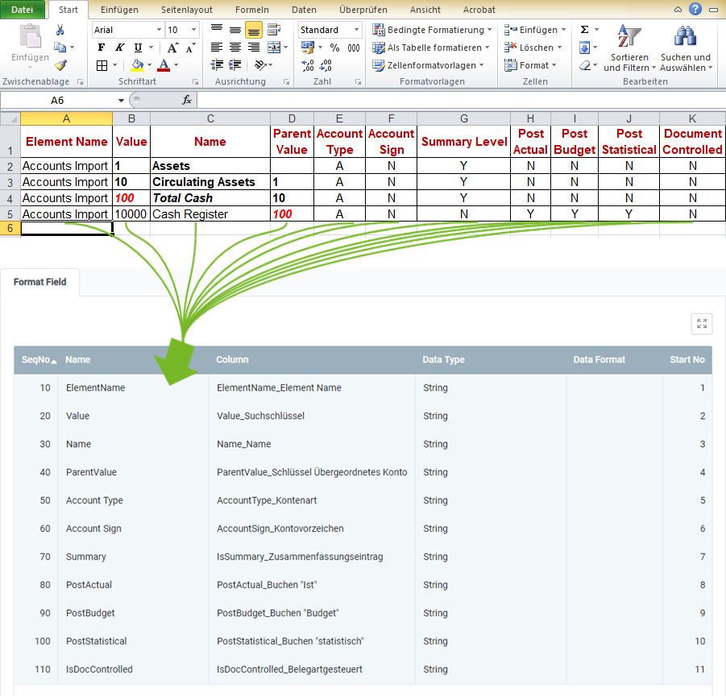

## Overview
For importing chart of accounts data, you require an import format that is configured with the **database table** *Import Account*.

The example below compares the data content of a file from a spreadsheet software (here, e.g., an *Excel* file prior to its [conversion to a CSV or TXT file](Import_file_useful_tips)) with the import format for chart of accounts data:

### Explanatory Notes to the Example
- **Column A** of the Excel spreadsheet (*Element Name*) is in the first place, ergo the corresponding format field is given the **Start No. 1**. Consequently, the format field for **Column B** receives the **Start No. 2** etc.  The order (**SeqNo**) of the format fields is therefore irrelevant.
 >**Note:** metasfresh does ***not expect any column names*** in the import file. Simply the ***position*** of the column must correspond to the start number.

- The **Name** of the format field may be chosen freely and does not have to coincide with the column name in the import file.
- The **Column** of the format field specifies where metasfresh shall transfer the content of the column from the import file.
- The **Data Type** specifies whether the type of the import data is, e.g., a *String* or a *Number*.

### Some useful notes
The mandatory fields are essential for a successful data import!

| Mandatory Field | <abbr title="Hover your cursor over the field name to see the corresponding column name.">Field Name</abbr> | Example | Note |
| :---: | :---: | :--- | :--- |
| X | <abbr title="ElementName_Element Name">Element Name</abbr> | Accounts Import | Name of the chart of accounts |
| X | <abbr title="Value_Suchschlüssel">Value</abbr> | 10 | Search key of the accounting element (is also used to structure the elements among each other). |
| X | <abbr title="Name_Name">Name</abbr> | Circulating Assets | Name of the accounting element |
|  | <abbr title="ParentValue_Schlüssel Übergeordnetes Konto">Parent Value</abbr> | 1 | Search key of the parent (summary) account (is also used to structure the elements among each other). |
|  | <abbr title="AccountType_Kontenart">Account Type</abbr> | •&nbsp;A = Assets  •&nbsp;E = Expense  •&nbsp;O = Owner's Equity  •&nbsp;R = Revenue  •&nbsp;M = Memo  •&nbsp;L = Liabilities | Type of the account |
|  | <abbr title="AccountSign_Kontovorzeichen">Account Sign</abbr> | •&nbsp;N / false = Natural  •&nbsp;C = Credit  •&nbsp;D = Debit | Indicates the natural sign of the account as a debit or credit. |
|  | <abbr title="IsSummary_Zusammenfassungseintrag">Summary Level</abbr> | •&nbsp;Y / true = Yes  •&nbsp;N / false = No | In a tree structure, summary entities represent a superior branch that combines child entries and can therefore be used for reporting. |
|  | <abbr title="PostActual_Buchen &quot;Ist&quot;">Post Actual</abbr> | •&nbsp;Y / true = Yes  •&nbsp;N / false = No | Indicates whether actual values can be posted to an element. |
|  | <abbr title="PostBudget_Buchen &quot;Budget&quot;">Post Budget</abbr> | •&nbsp;Y / true = Yes  •&nbsp;N / false = No | Indicates whether budget values can be posted to an element. |
|  | <abbr title="PostStatistical_Buchen &quot;statistisch&quot;">Post Statistical</abbr> | •&nbsp;Y / true = Yes  •&nbsp;N / false = No | Indicates whether statistical values can be posted to an element. |
|  | <abbr title="IsDocControlled_Belegartgesteuert">Document Controlled</abbr> | •&nbsp;Y / true = Yes  •&nbsp;N / false = No | If an account is controlled by a document, you cannot post to it manually. |

## Next Steps
- [Import chart of accounts data](Import_charts_of_accounts).
