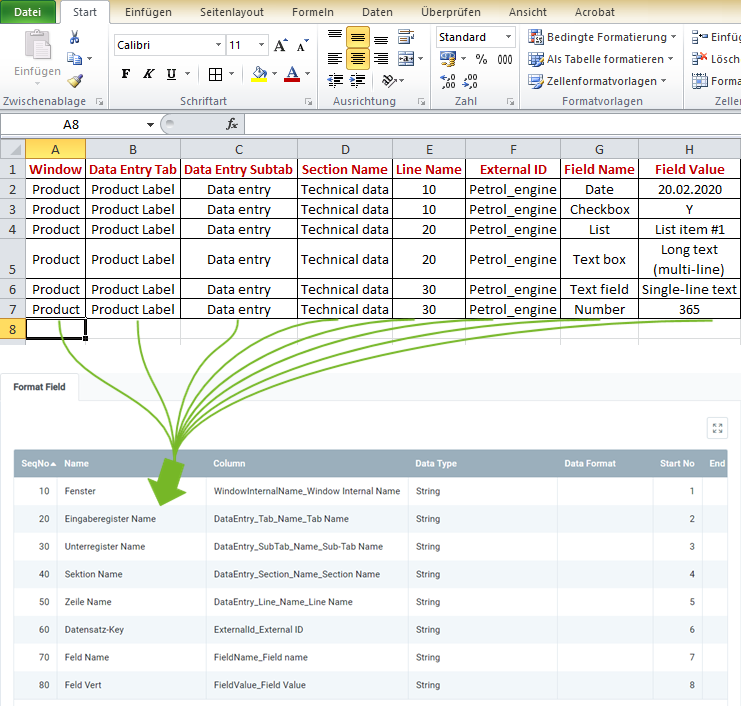

## Overview
For importing [custom data entries](Add_custom_record_tab), you require an import format that is configured with the **database table** *Import Data Entry Record*.

The example below compares the data content of a file from a spreadsheet software (here, e.g., an *Excel* file prior to its [conversion to a CSV or TXT file](Import_file_useful_tips)) with the import format for custom data entries:

### Explanatory Notes to the Example
- **Column A** of the Excel spreadsheet (*Window*) is in the first place, ergo the corresponding format field is given the **Start No. 1**. Consequently, the format field for **Column B** receives the **Start No. 2** etc.  The order (**SeqNo**) of the format fields is therefore irrelevant.
 >**Note:** metasfresh does ***not expect any column names*** in the import file. Simply the ***position*** of the column must correspond to the start number.

- The **Name** of the format field may be chosen freely and does not have to coincide with the column name in the import file.
- The **Column** of the format field specifies where metasfresh shall transfer the content of the column from the import file.
- The **Data Type** specifies whether the type of the import data is, e.g., a *String* or a *Number*.

### Some useful notes
The mandatory fields are essential for a successful data import!

| Mandatory Field | <abbr title="Hover your cursor over the field name to see the corresponding column name.">Field Name</abbr> | Example | Note |
| :---: | :---: | :--- | :--- |
| X | <abbr title="WindowInternalName_Window Internal Name">Window</abbr> | Product | System internal input window name. (If in doubt, please consult the system administrator.) |
| X | <abbr title="DataEntry_Tab_Name_Tab Name">Data Entry Tab</abbr> | Product Label | Name of the custom record tab |
| X | <abbr title="DataEntry_SubTab_Name_Sub-Tab Name">Data Entry Subtab</abbr> | Data entry | Name of the subtab |
|  | <abbr title="DataEntry_Section_Name_Section Name">Section Name</abbr> | Technical data | Name of the section |
|  | <abbr title="DataEntry_Line_Name_Line Name">Line Name</abbr> | •&nbsp;10  •&nbsp;20  •&nbsp;... | Sequence number of the line |
| X | <abbr title="ExternalId_External ID">External ID</abbr> | Petrol_engine | Search key of the data entry |
| X | <abbr title="FieldName_Field name">Field Name</abbr> | Date | Name of the field  (**Important note:** If several fields have the same name, the section name and/or line sequence number ***must*** be specified!) |
|  | <abbr title="FieldValue_Field Value">Field Value</abbr> | 2020-02-20 | Value or content of the field.  The following values can be specified for the following field data types (see [Custom data entry - field](Add_fields_to_section_lines)):  •&nbsp;Date: `YYYY-MM-DD` (in acc. with ISO 8601)  •&nbsp;Checkbox: Y (`= activated`), N (`= deactivated`)  •&nbsp;List: `Name of the list item`  •&nbsp;Text box: `Text (multi-line)`  •&nbsp;Text field: `Text (single-line)`  •&nbsp;Number: `Numeric value`   If no field value is specified, any existing field contents in the input tab will be deleted. |

## Next Steps
- [Import custom data entries](Import_custom_data_entries).
