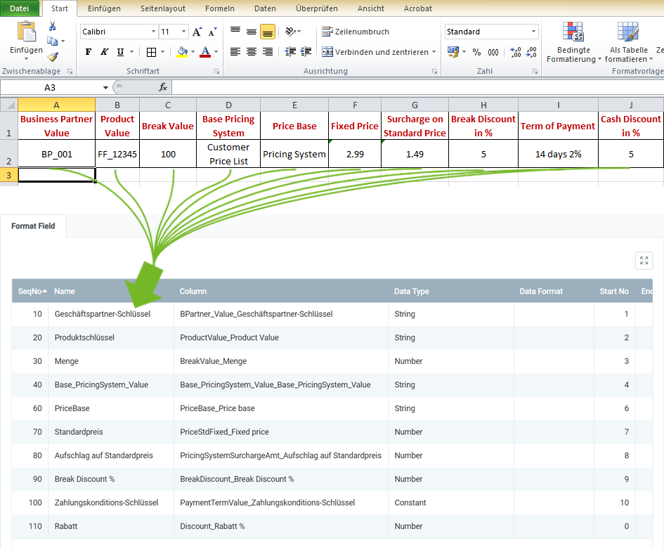

## Overview
For importing discount schemas, you require an import format that is configured with the **database table** *Discount Schema Import*.

The example below compares the data content of a file from a spreadsheet software (here, e.g., an *Excel* file prior to its [conversion to a CSV or TXT file](Import_file_useful_tips)) with the import format for discount schemas:

### Explanatory Notes to the Example
- **Column A** of the Excel spreadsheet (*Business Partner Value*) is in the first place, ergo the corresponding format field is given the **Start No. 1**. Consequently, the format field for **Column B** receives the **Start No. 2** etc.  The order (**SeqNo**) of the format fields is therefore irrelevant.
 >**Note:** metasfresh does ***not expect any column names*** in the import file. Simply the ***position*** of the column must correspond to the start number.

- The **Name** of the format field may be chosen freely and does not have to coincide with the column name in the import file.
- The **Column** of the format field specifies where metasfresh shall transfer the content of the column from the import file.
- The **Data Type** specifies whether the type of the import data is, e.g., a *String* or a *Number*.

### Some useful notes
The mandatory fields are essential for a successful data import!

| Mandatory Field | Field Name | Example | Note |
| :---: | :---: | :--- | :--- |
| X | Business Partner Value | BP_001 | Business partner number (unique alphanumeric string) |
| X | Product Value | FF_12345 | **Search Key** of the product (alphanumeric string) |
| | Break Value | 100 | Minimum amount of a product at which a pricing condition applies. |
| | Base_PricingSystem_Value | Customer Price List | **Search Key** of the pricing system used as basis for price determination. |
| | PriceBase | • Pricing System  • Fixed | **Price base** may be either the pricing system or an individually specified fixed price. |
| | Fixed Price | 2.99 | This information is only required if the **Price base** is set on *Fixed*. |
| | Surcharge on Standard Price | 1.49 | This information is only required if the **Price base** is set on *Pricing System*. |
| | Break Discount % | 5 | Volume discount in percent |
| | Term of Payment | 14 days 2% | Payment term for a pricing condition |
| | Discount | 5 | Cash discount for payment within the period. |

## Next Steps
- [Import discount schema](Import_discount_schema).
