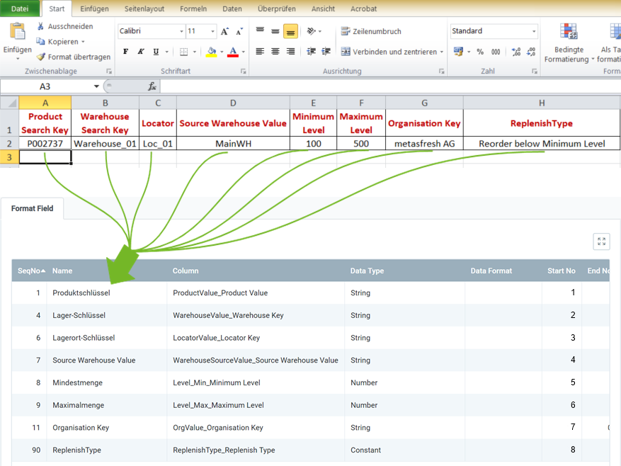

## Overview
For importing replenishment data, you require an import format that is configured with the **database table** *Import Replenishment*.

The example below compares the data content of a file from a spreadsheet software (here, e.g., an *Excel* file prior to its [conversion to a CSV or TXT file](Import_file_useful_tips)) with the import format for replenishment data:

### Explanatory Notes to the Example
- **Column A** of the Excel spreadsheet (*Product Search Key*) is in the first place, ergo the corresponding format field is given the **Start No. 1**. Consequently, the format field for **Column B** receives the **Start No. 2** etc.  The order (**SeqNo**) of the format fields is therefore irrelevant.
 >**Note:** metasfresh does ***not expect any column names*** in the import file. Simply the ***position*** of the column must correspond to the start number.

- The **Name** of the format field may be chosen freely and does not have to coincide with the column name in the import file.
- The **Column** of the format field specifies where metasfresh shall transfer the content of the column from the import file.
- The **Data Type** specifies whether the type of the import data is, e.g., a *String* or a *Number*.

### Some useful notes

| Mandatory Field | <abbr title="Hover your cursor over the field name to see the corresponding column name.">Field Name</abbr> | Example | Note |
| :---: | :---: | :--- | :--- |
| X | <abbr title="ProductValue_Product Value">Product Search Key</abbr> | P002737 | **Search Key** of the product for replenishment (alphanumeric string) |
| X | <abbr title="WarehouseValue_Warehouse Key">Warehouse Search Key</abbr> | Warehouse_01 | **Search Key** of the warehouse (alphanumeric string) |
| X | <abbr title="ReplenishType_Replenish Type">ReplenishType</abbr> | *Reorder below minimum level* | Method for re-ordering a product |
| X | <abbr title="Level_Min_Minimum Level">Minimum Level</abbr> | 100 | Minimum inventory level for the product |
| X | <abbr title="Level_Max_Maximum Level">Maximum Level</abbr> | 500 | Maximum inventory level for the product |
|  | <abbr title="WarehouseSourceValue_Source Warehouse Value">Source Warehouse Value</abbr> | MainWH | **Search Key** of the source warehouse |
|  | <abbr title="OrgValue_Organisation Key">Organisation Key</abbr>  (=OrgValue) | metasfresh AG | **Search Key** of the organization.  ***Attention:*** Not the name!  (*You can look up the search key under "[Organization](Menu)" in the menu.*) |

## Next Steps
- [Import replenishment data](Import_replenishment_data).
