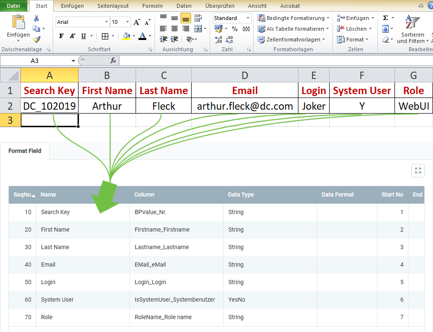

## Overview
For importing user data, you require an import format that is configured with the **database table** *Import User*.

The example below compares the data content of a file from a spreadsheet software (here, e.g., an *Excel* file prior to its [conversion to a CSV or TXT file](Import_file_useful_tips)) with the import format for user data:

### Explanatory Notes to the Example
- **Column A** of the Excel spreadsheet (*Search Key*) is in the first place, ergo the corresponding format field is given the **Start No. 1**. Consequently, the format field for **Column B** receives the **Start No. 2** etc.  The order (**SeqNo**) of the format fields is therefore irrelevant.
 >**Note:** metasfresh does ***not expect any column names*** in the import file. Simply the ***position*** of the column must correspond to the start number.

- The **Name** of the format field may be chosen freely and does not have to coincide with the column name in the import file.
- The **Column** of the format field specifies where metasfresh shall transfer the content of the column from the import file.
- The **Data Type** specifies whether the type of the import data is, e.g., a *String* or a *Number*.

### Some useful notes
The mandatory fields are essential for a successful data import!

| Mandatory Field | <abbr title="Hover your cursor over the field name to see the corresponding column name.">Field Name</abbr> | Example | Note |
| :---: | :---: | :--- | :--- |
| X | <abbr title="BPValue_Nr.">Search Key</abbr> | DC_102019 | Search key of the business partner linked to the user (unique alphanumeric string) |
| X | <abbr title="Firstname_Firstname">First Name</abbr> | Arthur | User's first name |
| X | <abbr title="Lastname_Lastname">Last Name</abbr> | Fleck | User's last name |
|  | <abbr title="EMail_eMail">Email</abbr> | arthur.fleck@dc.com | User's email address |
|  | <abbr title="Login_Login">Login</abbr> | Joker | User's login |
|  | <abbr title="IsSystemUser_Systembenutzer">System User</abbr> | •&nbsp;Y / true = Yes  •&nbsp;N / false = No | Indicates whether it is a [system user](New_system_user) with access permissions. |
|  | <abbr title="RoleName_Role name">Role</abbr> | WebUI | The [user role](NewUserRole) defines user permissions to access functions and data. |

## Next Steps
- [Import user data](Import_user_data).
