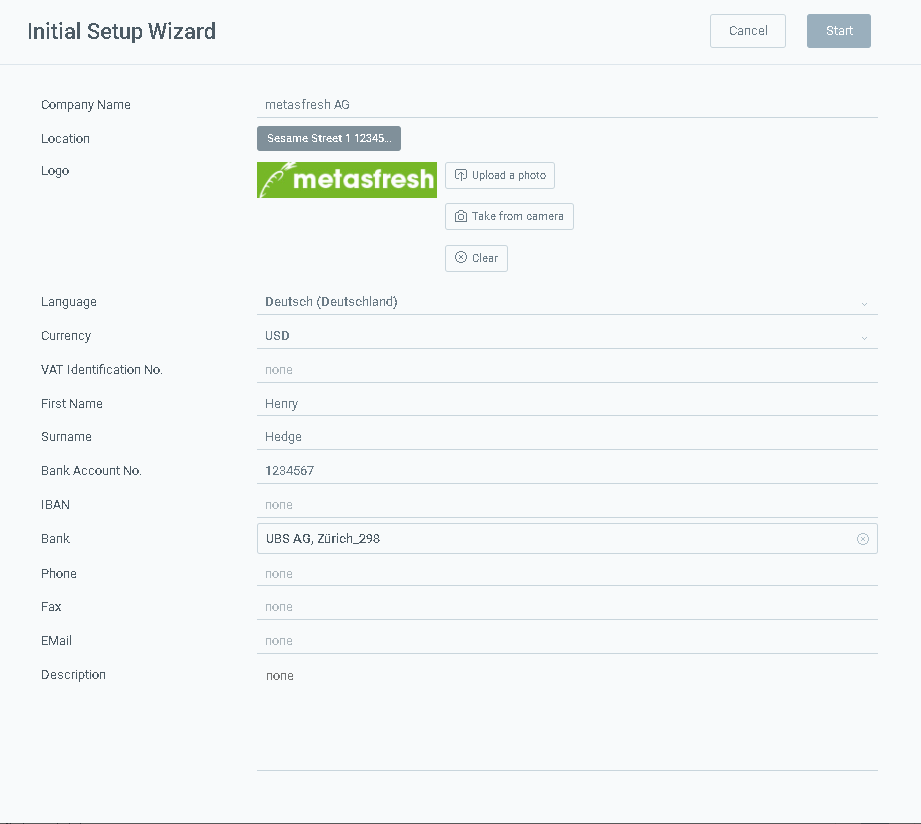

## Overview
Follow these steps to change the existing client "metasfresh" that is provided by default to your own Company Name.

## Steps

1. Open the "Initial Setup Wizard" from the [menu](Menu).
1. Upload an image as your logo via **upload a photo**.
 >Hint: The logo should not be bigger than 200x200 pixels to fit nicely on the documents.

1. Fill in the desired fields.
1. Click "Start" to apply the changes.
> Hint: You can apply the wizard as often as required to update your company details.
 

