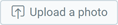
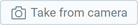
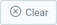
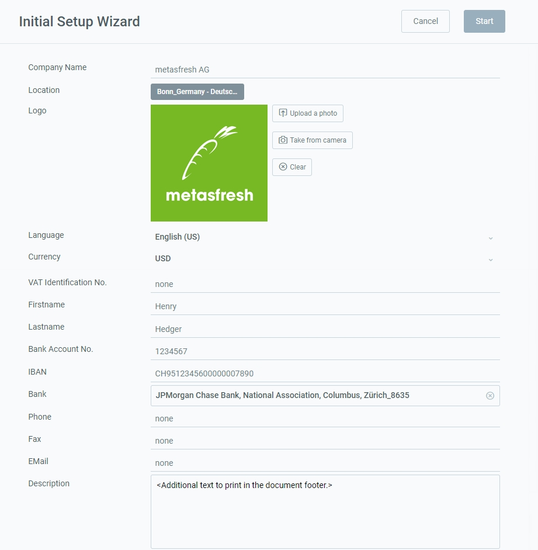

## Overview
Follow these steps to replace the information of the existing client "metasfresh", which is provided by default, with your own company information. All contact information (address, email, bank account details, etc.) will also appear on all documents in both the address line and the document footer.

For additional information on how to place manual text on documents, please see [here](Print_text_on_documents-general).

## Steps
1. Open the "Initial Setup Wizard" from the [menu](Menu).
1. Enter your **Company Name** the way it shall appear on documents.
1. Enter your company's **Location** the way it shall appear on documents.
 >**Note 1:** You have to enter least the country so that the settings can be saved correctly.  
 >**Note 2:** For a consistent calculation of dates and times at an international level, you can set the [reference time zone for an organization](Org_time_zone_setting).

1. Upload an image as your **Logo** via  or .
 >**Note 1:** The logo should not be bigger than 200x200 pixels to fit nicely on the documents.  
 >**Note 2:** To remove the photo, simply click .

1. Pick a **Language**.
1. Pick a **Currency** to be used as default currency in metasfresh.
1. Fill in the other fields as required, e.g., **VAT ID**, **Account No**, **IBAN**, etc.
 >**Note:** The text box **Description** is restricted to 90 characters.

1. Click "Start" to apply the changes and close the setup wizard.
 >**Note:** You can open the wizard as often as required to update your company details.

 

| **Note:** |
| :--- |
| You can also look up the complete business partner entry with your company details under "[Businesspartner Dist-Orgs](Menu)" in the menu. |

## Example

