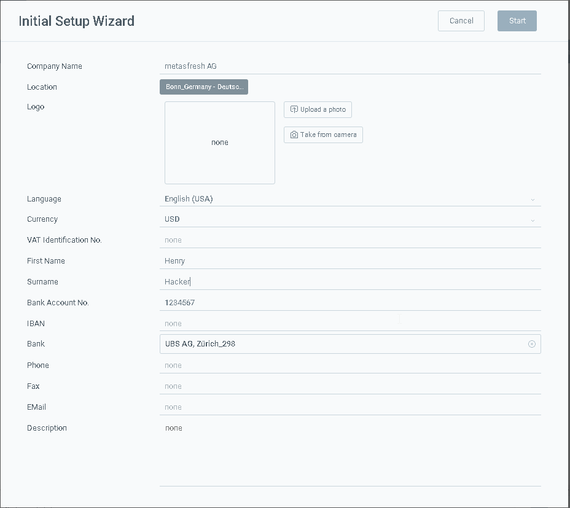

## Steps

1. Use the [menu](Menu) to open the "Initial Setup Wizard"
1. upload an image as logo

  *Hint:* The logo should not be bigger than 250px*250px or it wont fit nicely on documents.
1. fill out the fields
1. click "Start" to apply the changes

