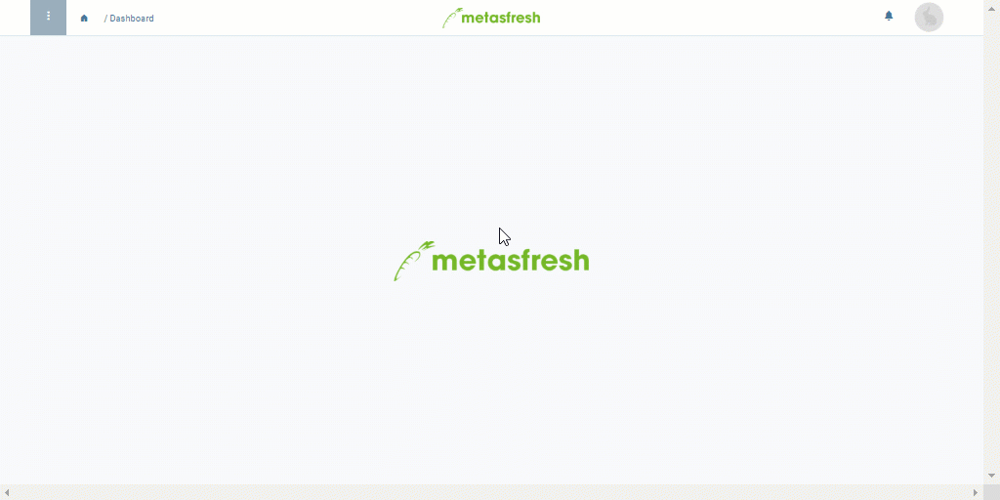

## Overview
Some products from your inventory are intended for internal use and are therefore no longer available for trade with other business partners. As a result, they have to be removed or disposed of from stock. For internal stocktaking, the used products are clearly arranged in an inventory list which enables you to keep track of where the products have gone.

## Steps
1. Open "Handling Unit Editor" from the [menu](Menu).
1. From the list, [select](RecordSelection) one or more [handling units](Handling_Unit_System) you want to post as internal use.
1. [Start the quick action](StartAction) "Mass Disposal". An overlay window opens up.
 >**Note:** You will also find this action in the actions menu.

1. In the field **Activity**, enter a part of the cost center and click on the matching result in the [drop-down list](Keyboard_shortcuts_reference), e.g., *Management*.
1. ***Optional:*** Enter a **Description** into the text field provided.
1. Click "Start" to close the overlay window and post the selected HUs as internal use.
1. You will receive a [notification](Notification_types)  in the upper right corner once the internal use is posted.
1. Click on the notification to open the internal use entry.
1. [Open the PDF print preview](PrintPreview) of the inventory document.

## Example

