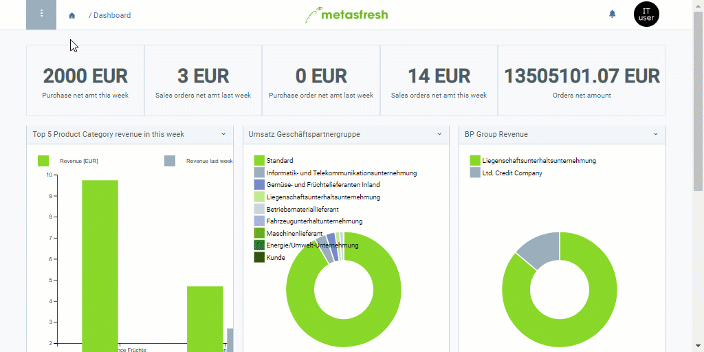

## Overview
In metasfresh, you can very easily transfer handling units (HUs) from one warehouse to another.

## Steps
1. Open "Handling Unit Editor" from the [menu](Menu).
1. [Select](RecordSelection) the handling units you want to transfer.
1. [Start the quick action](StartAction) "MoveToAnotherWarehouse". An overlay window opens up.
1. In the field **Warehouse** enter a part of the warehouse name and click on one of the results.
 >**Note 1:** Hit `SPACE` to see all available [warehouses](Add_new_warehouse).  
 >**Note 2:** Select one of the shown options with the mouse or .

1. Click "Start" to close the overlay window and transfer the HUs.
1. [metasfresh saves the progress automatically](Saveindicator).
 >**Note:** [Use the filter](Filtering_function) to quickly find the transferred HUs.

## Example

