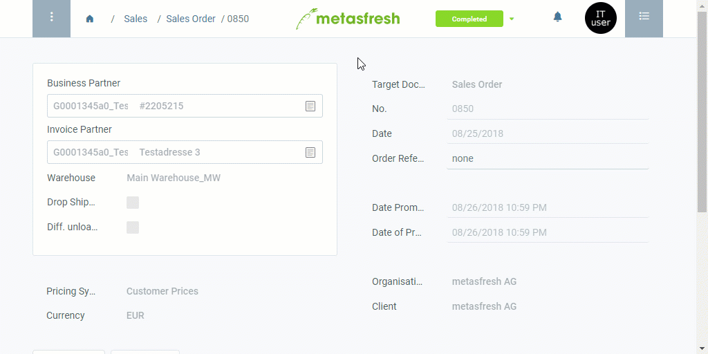

## Overview
Invoice-specific texts can only be recorded in the entry of a completed invoice and will subsequently only appear on the corresponding invoice document.

For additional information on how to place manual text on documents, please see [here](Print_text_on_documents-general).

## Steps
1. Open "Sales Invoice" from the [menu](Menu).
1. Open the entry of a [completed outgoing invoice](Invoice_SalesOrder). [Use the filter](Filtering_function) to help you find a specific invoice.
 >**Note:** You may also use the [related documents](JumptoviaSidebar) of a [completed](DocumentProcessingComplete) [sales order](SalesOrder_recording) to jump ***directly*** to the corresponding invoice document you want to edit.

1. Open the [advanced edit menu](ViewModes) from the [actions menu](StartAction).
 >**Note:** Use shortcut `Alt` + `E` / `⌥ alt` + `E`.

1. Scroll down to the text box **Description** and enter a text that shall appear at the top of the document.
1. In the text box **Document Foot Note**, enter a text that shall appear at the bottom of the document.
1. Click "Done" to apply the changes and close the advanced edit menu.
1. [Open the PDF preview](PrintPreview).

## Example

