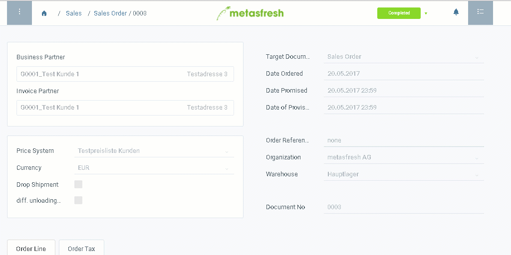

## Steps
1. Open a [sales order which was shipped](Ship_SalesOrder).
1. [Jump to](JumptoviaSidebar) "Invoice Disposition".
1. [Select the order lines](RecordSelection) you want to invoice.
1. [Start the action](StartAction) "Generate Invoices".
1. Click "Start" to confirm and close the window.
1. You will receive a notification  in the upper right corner once the invoice is generated.
1. Click on the notification to open the invoice document.
1. [Open the PDF print preview](PrintPreview).

## Example

