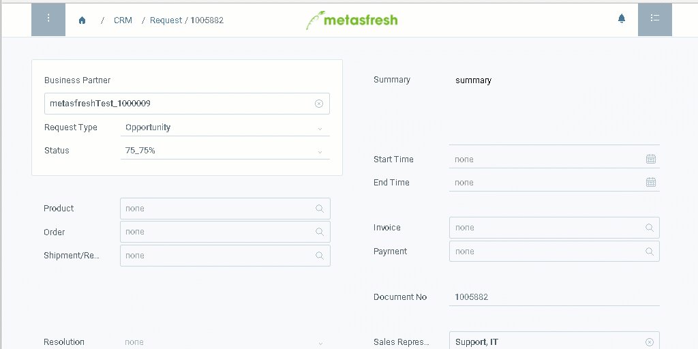

## Overview
If you want to review and perhaps edit the content of a field, you do not need to take the long way via the navigation menu to search for the entry. Instead, you can just jump directly to it via the field itself.

## Jumping via Field
1. [Open a document](Menu) of your choice, e.g., a [sales order](SalesOrder_recording).
1. Hover with your mouse cursor over the label of the field whose content you want to review or edit, e.g., **Business Partner**.
1. If the field label is underlined, click on it to switch into the respective window.
1. The window opens up in a new browser tab.
  

| **Important note!** |
| :- |
| You might need to disable your pop-up blocker to make this feature work. |

## Example

