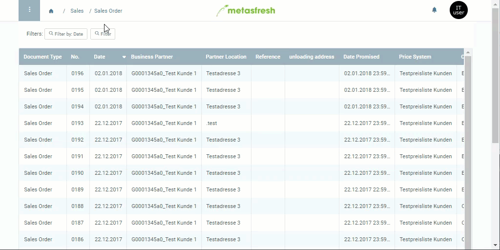

## Overview
This feature is available for record tab entries and offers another possibility to quickly reach related documents.

## Jumping via Context Menu
1. Open a document of your choice, e.g., a [sales order](SalesOrder_recording).
1. Go to a record tab at the bottom of the page, e.g., "Order Line".
1. Hover with your mouse cursor over a line and right-click it to open the context menu.
1. Click on the desired link with the  to switch into the respective window.
1. The window opens in a new tab.

## Example

