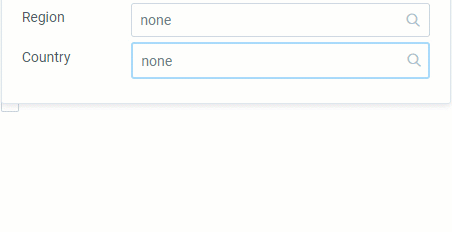

## Overview
In metasfresh, you can speed up some processes in several contexts by using certain key combinations. Here you will find a list of the keyboard commands.

### Global Context

| Keyboard Shortcut   (Windows) | Keyboard Shortcut   (MacOS) | Command |
| :---: | :---: | :--- |
| `Alt` + `1` | `⌥ alt` + `1` | Toggle Actions Menu  |
| `Alt` + `2` | `⌥ alt` + `2` | Toggle Navigation Menu  |
| `Alt` + `3` | `⌥ alt` + `3` | Toggle Notifications Inbox  |
| `Alt` + `4` | `⌥ alt` + `4` | Toggle User Menu  |
| `Alt` + `5` | `⌥ alt` + `5` | Toggle list of documents (Sidebar)  |
| `Alt` + `6` | `⌥ alt` + `6` | Toggle list of referenced documents (Sidebar)  |
| `Alt` + `7` | `⌥ alt` + `7` | Toggle list of attachments (Sidebar)  |
| `Alt` + `↵ Enter` | `⌥ alt` + `↵ Enter` | Open selected / Apply ("Done") / Apply filter |
| `Esc` | `esc` | Cancel |

### <a name="dropdown">Dynamic Search Box Context (Autocompletion)</a>
A dynamic search box is a searchable drop-down list, which updates with each letter typed into the text box, providing autocomplete suggestions to select by clicking on them.

| Keyboard Shortcut   (Windows/MacOS) | Command |
| :---: | :--- |
| `SPACE` | Show a selection of available data entries.  (Select one of the provided options with the mouse or .) |

**Example**: Dynamic drop-down list  
<kbd></kbd>

### Document Context ([list view](ViewModes))

| Keyboard Shortcut   (Windows) | Keyboard Shortcut   (MacOS) | Command |
| :---: | :---: | :--- |
| `Alt` + `A` | `⌥ alt` + `A` | Select all lines, i.e. toggle between "Select all on this page" and "Select all ## items" |
| `Alt` + `B` | `⌥ alt` + `B` | Open selected document in a new browser tab |
| `Alt` + `E` | `⌥ alt` + `E` | Open Advanced Edit Menu for selected document |
| `Alt` + `Y` | `⌥ alt` + `Y` | Delete selected document |

### Document Context ([detailed view](ViewModes))

| Keyboard Shortcut   (Windows) | Keyboard Shortcut   (MacOS) | Command |
| :---: | :---: | :--- |
| `Alt` + `D` | `⌥ alt` + `D` | Delete document |
| `Alt` + `E` | `⌥ alt` + `E` | Open Advanced Edit Menu |
| `Alt` + `I` | `⌥ alt` + `I` | Toggle Document Processing Actions (action button for document status) |
| `Alt` + `K` | `⌥ alt` + `K` | Open Email Editor |
| `Alt` + `N` | `⌥ alt` + `N` | Create New Document |
| `Alt` + `P` | `⌥ alt` + `P` | Open Print Preview |
| `Alt` + `U` | `⌥ alt` + `U` | Set document status to "Complete" |
| `Alt` + `W` | `⌥ alt` + `W` | Clone document |
| `Alt` + `Z` | `⌥ alt` + `Z` | *Only in sales orders:*  Open product proposal overlay window |

### Record Tab Context (in document)

| Keyboard Shortcut   (Windows) | Keyboard Shortcut   (MacOS) | Command |
| :---: | :---: | :--- |
| `Alt` + `E` | `⌥ alt` + `E` | Open Advanced Edit Menu for selected line |
| `Alt` + `Q` | `⌥ alt` + `Q` | Toggle fast order line input (Batch Entry) |
| `Alt` + `Y` | `⌥ alt` + `Y` | Delete selected line |
| `Alt` + `+` | `⌥ alt` + `+` | Expand / collapse record tab |

### [Quick Actions](StartAction) Context

| Keyboard Shortcut   (Windows) | Keyboard Shortcut   (MacOS) | Command |
| :---: | :---: | :--- |
| `Alt` + `L` | `⌥ alt` + `L` | Toggle Quick Actions Menu |
| `Alt` + `U` | `⌥ alt` + `U` | Execute shown Quick Action |

### List View Context with several pages

| Keyboard Shortcut   (Windows) | Keyboard Shortcut   (MacOS) | Command |
| :---: | :---: | :--- |
| `PAGEDOWN` | `Fn` + `↓` | Turn over to next page |
| `PAGEUP` | `Fn` + `↑` | Turn back to previous page |
| `HOME` | `Fn` + `←` | Jump to first page |
| `END` | `Fn` + `→` | Jump to last page |

### List View Context with subitems

| Keyboard Shortcut   (Windows) | Keyboard Shortcut   (MacOS) | Command |
| :---: | :---: | :--- |
| `+` | `+` | Expand indent |
| `-` | `-` | Collapse indent |
| `Alt` + `S` | `⌥ alt` + `S` | Select all rows |

**Example**: Handling Unit Editor  
<kbd></kbd>
