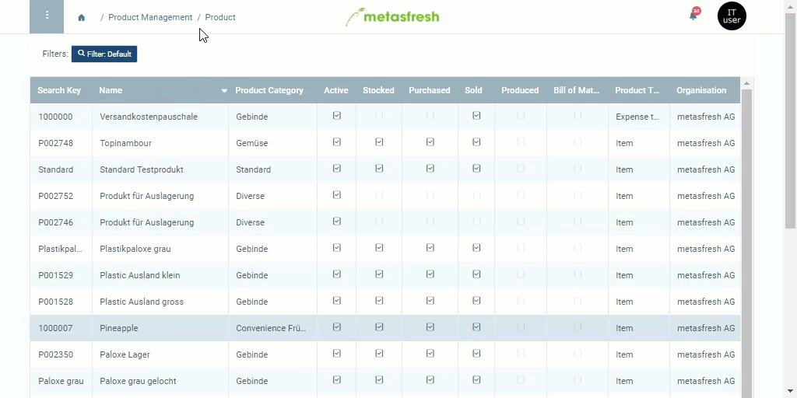

## Steps
1. Open the entry of an existing [product](Menu) or [add a new one](NewProduct).
1. Go to the record tab "Business Partner" at the bottom of the page and click . An overlay window opens up.
1. In the field **Business Partner**, enter a part of the [business partner](New_Business_Partner) name or number and click on the matching result in the [drop-down list](Keyboard_shortcuts_reference).
 >**Note:** Business partners can be [customers](New_business_partner_customer) and [vendors](New_business_partner_vendor).

1. Click "Done" to close the overlay window and add the business partner to the list.
 >**Note:** Repeat steps 2 to 4 to add further business partners.

## Example

