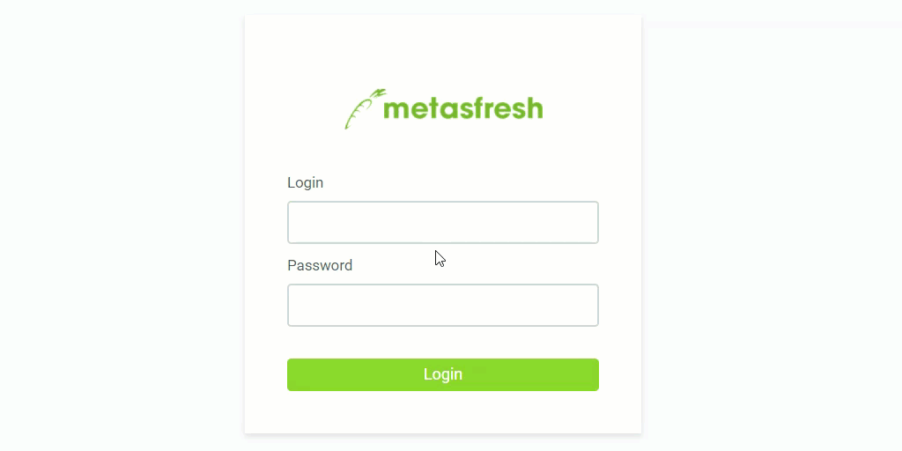

## Steps

### Log in as User
1. Open the metasfresh URL in your web browser, e.g., <abbr title="Just an example"><code>https://dockerhost</code></abbr> or <abbr title="Just an example"><code>https://live###.metasfresh.com</code>.
1. If you have installed the demo instance by yourself, log in with the **username** `it` and the **password** `metasfresh`. 
In case you have requested your own free demo instance <a href="https://metasfresh.com/en/nextgen/" title="metasfresh Cloud ERP &#124; metasfresh.com " target="\_blank">via our website</a>, you will receive your login information in the email confirming your registration.
 >**Important note:** Please note that the username and password are ***case-sensitive***!

### Log in as System Adminstrator

| **Note:** |
| :--- |
| This user cannot change the interface language in WebUI as it is possible on the Java client back end. To change this user's language, please see [here](../../support_collection\en\change_language_metasfresh_user.md). |

1. Open the URL of the metasfresh service in your web browser, e.g., <abbr title="Just an example"><code>https://dockerhost</code></abbr>.
1. Log in with the **username** `metasfresh` and the **password** `metasfresh`.
 >**Important note:** Please note that the username and password are ***case-sensitive***!

## Example
<kbd></kbd>
