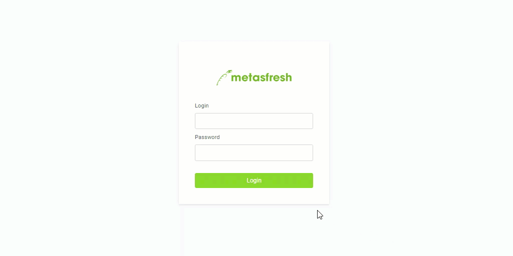

## Steps

1. Open the URL of the metasfresh Service in your browser. e.g. http://dockerhost
1. Use "metasfresh" and password "metasfresh" to log on (without "")

   **Important**: The username is also Case Sensitive!

1. Select Role "WebUI"

## Video

