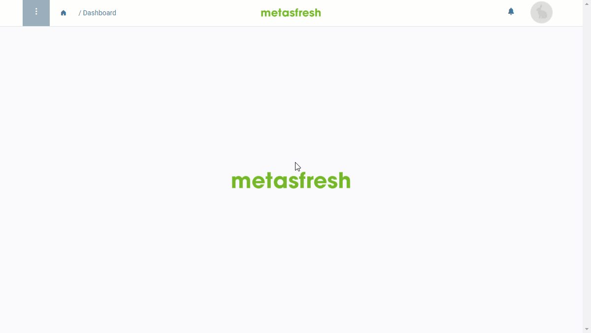

## Overview
In metasfresh, [user roles](NewUserRole) enable you to configure which windows and functionalities individual [users](Add_user) are permitted to access. In addition, user access can also be restricted or extended within the shared windows for certain data entries. This means that although a user is allowed to access a window, they may only be able to read, but not edit, individual or all entries, for example. Access to these management functions for data record permissions ("Grant Access" and "Revoke Access") can also be configured flexibly per individual user role.

## Requirements
- [Set up access to the record permissions management features](Record_permissions_setup). (System Administrator)

## Steps
1. Open any window from the [menu](Menu) where you want to manage user access permissions, e.g., "Business Partner".
    >**Note:** To be able to manage data access in a window, the underlying database table must have a [permission entry](Record_permissions_setup) in the role entry of the currently logged-in user.

1. Open an existing entry or [create a new one](New_Record_Window).
1. [Start the action](StartAction#actions-menu) "Grant Access" or "Revoke Access", depending on your intention. An overlay window opens up.
1. Pick an **Access** type, e.g., *Read*, *Write*, *Export* oder *Report*.
1. Pick a **Type** of user, e.g., an individual *[User](Add_user)* or a *[Nutzergruppe](Create_user_group)* (*User Group*)
1. In the field **Contact** (or **User Group**), enter part of the name of the user (group) whose access permission you want to adjust and click on the matching result in the <a href="Keyboard_shortcuts_reference#dropdown" title="Dynamic Search Box (Autocompletion)">drop-down list</a>.
1. Click "Start" to apply the changes and close the overlay window.
1. [metasfresh saves the progress automatically](Saveindicator).

## Example
<kbd></kbd>
