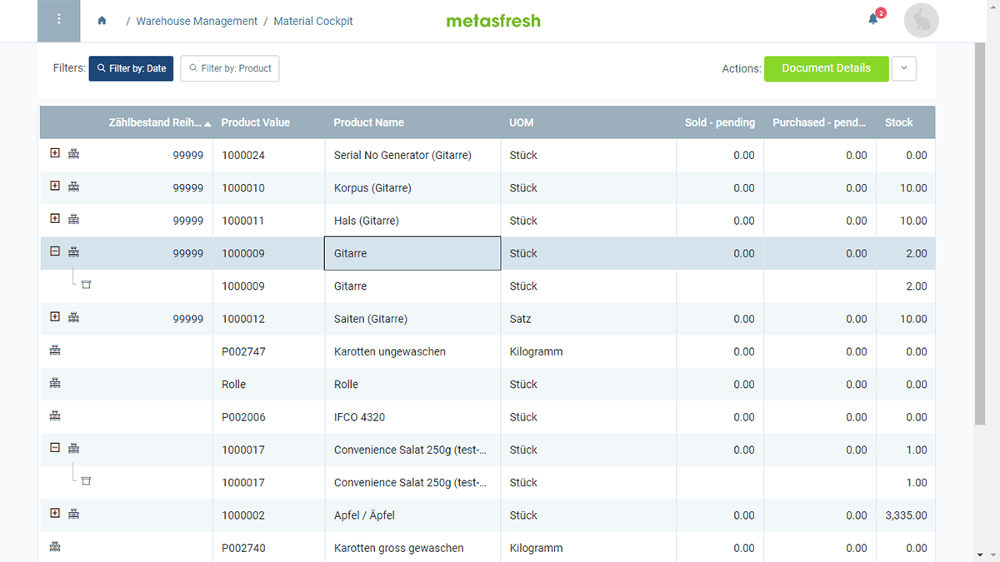

## Overview
In metasfresh, you can use the **Material Cockpit** (or Trading Desk) to view and manage the quantities of your products in stock as well as other stock and document-related details, such as [highest purchase prices](Material-Cockpit-highest-purchase-price).

## Steps
1. Open "Material Cockpit" from the [menu](Menu).
1. [Use the filter](Filtering_function) to help you find specific [handling units (HUs)](Handling_Unit_System).
1. HU entries with multiple levels ([CU/TU/LU](Handling_Unit_System)) can also be [expanded and collapsed using the keyboard](Keyboard_shortcuts_reference#manage-list-elements) (`+`/`-`).

## Next Steps (optional)
- [Record stock quantities via physical inventory](Physical_inventory_create_HUs) or add new [handling units](Handling_Unit_System) to your stock.
- [Add a column for the highest purchase price to the list view. (System Administrator)](Material-Cockpit-highest-purchase-price)

## Example
<kbd></kbd>
