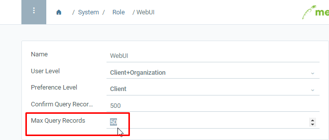
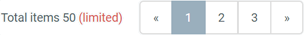

## Overview
You can limit the search results a user may see in the list view to a maximum. To do so, take the following steps:

## Steps
1. Open "Role" from the [menu](Menu).
1. Open the entry of an existing user role or [create a new one](NewUserRole).
1. Enter a number in the field **Max Query Records**, e.g. "50". 

1. From now on, no search results above this limit will be shown to the user. This is then indicated in [list view](ViewModes) in the pagination at the bottom right: .
