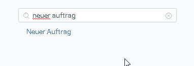

## Open the menu
Click  or use shortcut `Ctrl + 2` to open the menu.

## Click a node
Click on the node you want to open. 

## Use the search field

In case you do not find what you are looking for you can also use the search field in the menu.

Just type in the feature you are looking for and press `ENTER`. 

## See the full menu

In case you want to see the full menu you can click on "browse whole tree" in the lower right corner. 
 
