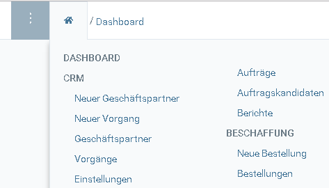
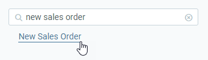
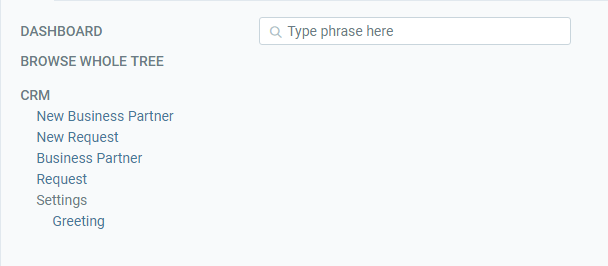

## Open the menu
Click  or use shortcut `Alt + 2` to open the menu.

## Click a node
Click on the node you want to open. 

## Use the search field

In case you do not find what you are looking for you can also use the search field in the menu.

Just type in the feature you are looking for (e.g. "New Sales Order") and click the link to open the window. 

## See the full menu

To see the full menu, click on **BROWSE WHOLE TREE**. 
 
