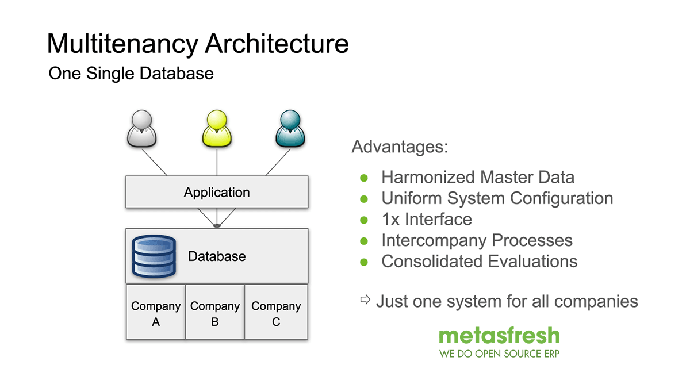

## Overview
metasfresh supports an unlimited number of tenants (clients). The data of these clients are kept logically separated from each other and are therefore only visible to the respective client.

| Client | Scope |
| :---: | :--- |
| * | Contains all system objects such as windows, tabs, fields, reports, processes, settings. |
| metasfresh AG | Is preconfigured for use and contains some sample data. |
| Further Clients | Basically you can add as many clients as you wish. **Note:** Adding new clients involves some configuration effort. We therefore recommend that you continue using the standard client "metasfresh AG". |

 

<kbd></kbd>
