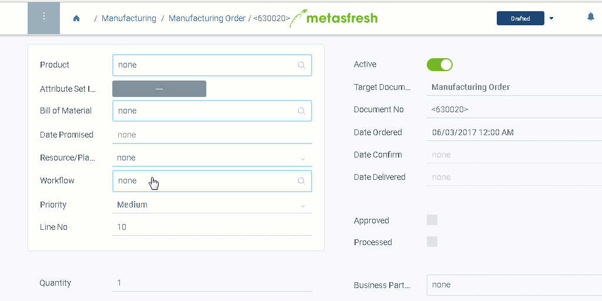

## Steps

1. Open "Manufacturing Order" from the [menu](Menu).
1. [Create a new Manufacturing Order](New_Record_Window).
1. Enter the [**Product**](NewProduct) you want to manufacture.
1. Choose the [**Bill of Materials** (BOM)](Create_BOM) according to which the manufacturing shall be completed.
1. In the field **Date Promised** record the date and time of completion of the product.
1. The **Resource/Plant** contains the designated manufacturing facility.
1. The **Workflow** determines the required manufacturing steps.
1. Record the **Quantity** of the product you want to manufacture.
1. [Complete the order](DocumentProcessingComplete).
 

## Example

