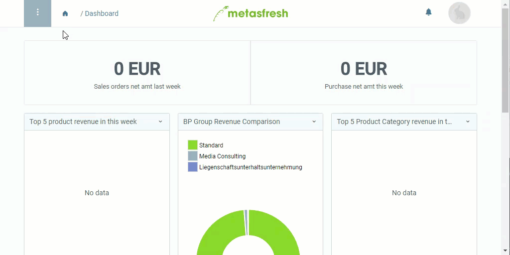

## Steps
1. Open "Product Category" from the [menu](Menu).
1. [Create a new product category](New_Record_Window).
1. Give the category a **Name**.
1. [metasfresh saves the progress automatically](Saveindicator).

## Additional settings (optional)
- Set an **Attribute Set**.
- [Set a **parent product category**](ParentProductCategory).
- In the field **Product sequence**, pick a [document sequence](Define_new_doc_sequence). To do so, enter a part of the document sequence name and click on the matching result in the <a href="Keyboard_shortcuts_reference#dropdown" title="Dynamic Search Box (Autocompletion)">drop-down list</a>.

## Example

