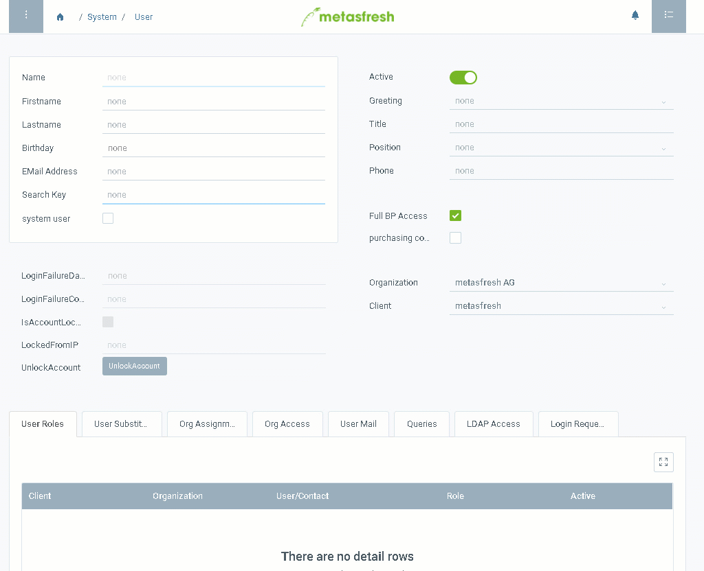

## Overview

Users are basically contacts with login permission. That is why you also find the contacts of your business partners in the "User" window. 
You can create new contacts or allow existing contacts to log on to the system by following these steps:

## Steps

### Create a contact
1. [Log on](Logon) to the system.
1. Open "User" from the [menu](Menu).
1. [Create a new User](New_Record_Window).
1. Fill in the fields **Firstname** and **Lastname**.
1. Enter a **Search Key**.

### Turn the contact into a System User
1. Tick the box **System User** to give the contact user permissions.
1. In the field **Login** enter a username.
1. Enter a **Password** with at least 8 characters.

  > Note 1: Make sure the password consists of **at least 8 characters** or the new record **will not be saved**!  
  > Note 2: The user can log on using either the **login** or the **email address** as username.  
  > Note 3: The username and password are both **case-sensitive**!

### Assign a role to the user to grant permission
1. Go to the record tab "User Roles" at the bottom of the page.
1. [Add a new role](New_Record_Tab).
1. Pick the role you want to assign to the user.
1. Click "Done" to add the role to the list.

   > Note: A user can have several roles. In this case they will be asked to choose a role at the login.

## Example

This example shows the creation of a user "mf" with the role "WebUI":

