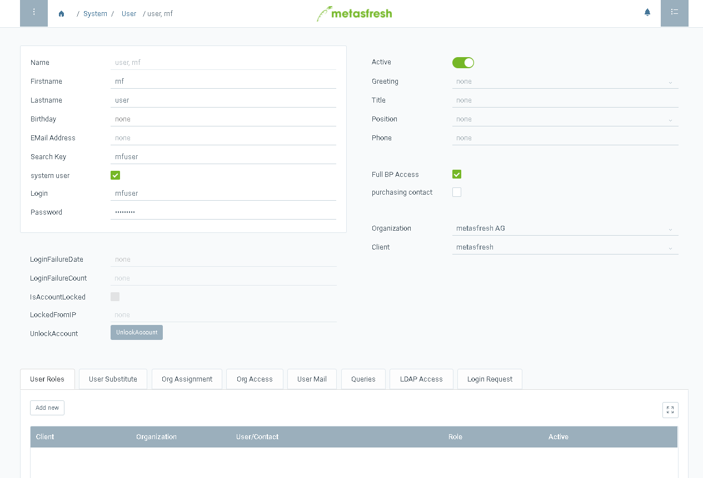

## Overview

Users are basically contacts that have login permission. That is why you find contacts of your business partners also in the user window. You can allow them to log on to the system or create new users by following this steps.

## Steps

### create a contact
1. [Open window](Menu) "User"
1. Create [new record](New_Record_Window)
1. fillout the fields **Firstname** and **Lastname**
1. enter a **Search Key**

### Make the contact an user
1. Tick **Systemuser** to make this contact an actual user
1. put a **login** which is the actual user name
1. enter a **password** with at least 8 characters

  > Note: Make sure to make the password **at least 8 characters** or the new record **will not be saved**
  
  > Note 2: The user can use either the login or the email address as user name.
  
  > Note 3: The user name and the password are **case sensitive**!
  

### assign a role to the user to grant permission
1. go to tab Role
1. [add a record](New_Record_Tab)
1. pick the role or roles you want to give the user

### Example

this shows a user with admin role and the username "mfuser"

